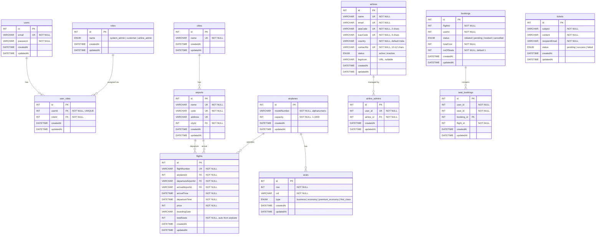

# Database Entity Relationship Diagram

## Overview

The Flights Booking App uses a **microservices architecture** with **4 separate MySQL databases**, each owned by a dedicated service. This ensures data isolation and independent scalability per service.

| Service | Database | Port |
|---|---|---|
| API Gateway | `api_gateway_db` | 3001 |
| Flights Booking Service | `flights_booking_db` | 3002 |
| Flights Creation Service | `flights_db` | 3003 |
| Notifications Service | `notifications_db` | 3005 |

> The **Flights Searching Service** (port 3004) does not own a database — it reads from the Flights Creation Service via HTTP and caches results in Redis.

---

## ER Diagram

---

## Databases & Tables

| Database | Service | Tables |
|---|---|---|
| `api_gateway_db` | API Gateway | `users`, `roles`, `user_roles` |
| `flights_db` | Flights Creation Service | `flights`, `airplanes`, `airports`, `cities`, `airlines`, `airline_admins`, `seats` |
| `flights_booking_db` | Flights Booking Service | `bookings`, `seat_bookings` |
| `notifications_db` | Notifications Service | `tickets` |

---

## Cross-Service References

These are **logical references** (not foreign keys) between databases:

| Source Table | Column | References | Target Database |
|---|---|---|---|
| `bookings.flightId` | flightId | `flights.id` | `flights_db` |
| `bookings.userId` | userId | `users.id` | `api_gateway_db` |
| `seat_bookings.user_id` | user_id | `users.id` | `api_gateway_db` |
| `seat_bookings.flight_id` | flight_id | `flights.id` | `flights_db` |
| `airline_admins.user_id` | user_id | `users.id` | `api_gateway_db` |

---

## Indexes

### API Gateway DB (`api_gateway_db`)

| Table | Index Name | Columns | Unique |
|---|---|---|---|
| `users` | `idx_users_email` | `email` | Yes |

### Flights Creation DB (`flights_db`)

| Table | Index Name | Columns | Unique |
|---|---|---|---|
| `flights` | `idx_flights_flightNumber` | `flightNumber` | Yes |
| `flights` | `idx_flights_route` | `departureAirportId`, `arrivalAirportId` | No |
| `flights` | `idx_flights_departureTime` | `departureTime` | No |
| `flights` | `idx_flights_price` | `price` | No |
| `airports` | `idx_airports_code` | `code` | Yes |
| `airlines` | `idx_airlines_iataCode` | `iataCode` | Yes |

### Flights Booking DB (`flights_booking_db`)

| Table | Index Name | Columns | Unique |
|---|---|---|---|
| `bookings` | `idx_bookings_userId` | `userId` | No |
| `bookings` | `idx_bookings_flightId` | `flightId` | No |
| `bookings` | `idx_bookings_status` | `status` | No |
| `seat_bookings` | `unique_seat_flight` | `seat_id`, `flight_id` | Yes |
| `seat_bookings` | `idx_seatbookings_bookingId` | `bookingId` | No |
| `seat_bookings` | `idx_seatbookings_flightId` | `flightId` | No |

### Notifications DB (`notifications_db`)

| Table | Index Name | Columns | Unique |
|---|---|---|---|
| `tickets` | `idx_tickets_status` | `status` | No |
| `tickets` | `idx_tickets_recipientEmail` | `recipientEmail` | No |
